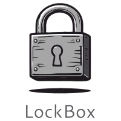

<div align="center">



# LockBox

**An offline password manager with browser autofill — Qt 6 desktop app + Chrome extension.**

*Built as the Final Year capstone project for the B.Tech in CSE (Cyber Security) programme at Amrita Vishwa Vidyapeetham.*

</div>

---

## What is LockBox?

LockBox is an **offline password manager**. The vault is stored locally on your machine, encrypted with **Argon2id + XChaCha20-Poly1305**, and never leaves your device. A companion Chrome extension talks to the desktop app over an encrypted local WebSocket bridge so you still get one-click autofill on the web — without a cloud server in the middle.


## Features

- 🔐 Local encrypted vault (SQLite, encrypted at rest)
- 🗝️ Argon2id master-password derivation
- 🌐 Chrome extension with autofill on any website
- 🔗 Encrypted local IPC (paired WebSocket + AES-GCM)
- 🛡️ TOTP (2FA code) generator
- 🚨 Have I Been Pwned breach checking
- ⏱️ Auto-lock on inactivity
- 🎲 Built-in password generator with strength meter
- 📤 Vault import / export

---

## Quick Start (TL;DR)

For the impatient — assumes you have Qt 6, libsodium, OpenSSL, and CMake already installed.

```bash
git clone https://github.com/Anaswara-Suresh/password-manager.git
cd password-manager/LockBox
mkdir build && cd build
cmake ..              # macOS: add -DCMAKE_PREFIX_PATH="$(brew --prefix qt)"
cmake --build . -j
./LockBox             # macOS: open LockBox.app
```

Then load the extension at `chrome://extensions` → Developer Mode → Load Unpacked → pick `LockBox/browser/chrome-test/`.

If anything in the above didn't make sense, follow the detailed sections below.

---

## Prerequisites

You'll need these on every platform:

| Tool | Minimum version | Why |
|---|---|---|
| **Qt** | 6.x (or 5.15+) | Widgets, Sql, Network, WebSockets |
| **libsodium** | 1.0.18+ | Argon2id + XChaCha20-Poly1305 |
| **OpenSSL** | 1.1+ or 3.x | AES-GCM bridge crypto, HIBP SHA-1 |
| **CMake** | 3.16+ | Build system |
| **C++17 compiler** | Clang / GCC / MSVC | — |
| **Google Chrome** | Recent | For the extension |

---

## Setup — macOS

### 1. Install dependencies

If you don't have Homebrew yet, install it from [brew.sh](https://brew.sh).

```bash
brew install qt libsodium openssl cmake
```

### 2. Clone & build

```bash
git clone https://github.com/Anaswara-Suresh/password-manager.git
cd password-manager/LockBox
mkdir -p build
cd build
cmake .. -DCMAKE_PREFIX_PATH="$(brew --prefix qt)"
cmake --build . -j
```

The build produces a macOS app bundle: `build/LockBox.app`.

### 3. Run

```bash
open LockBox.app
```

Or double-click `LockBox.app` in Finder.

> ⚠️ **Important — `style.qss` working-directory quirk.** The app loads its stylesheet relative to the current working directory. If the UI looks unstyled (gray, no theme), launch the binary from the `build/` directory, or copy `style.qss` next to the app bundle's executable.

### 4. macOS first-launch warning

On first launch you'll likely see *"LockBox cannot be opened because the developer cannot be verified"* — this is Gatekeeper, expected for unsigned local builds. Right-click the app → **Open** → confirm. macOS will remember this choice.

---

## Setup — Windows

### 1. Install dependencies

**Qt 6** — install via the [Qt Online Installer](https://www.qt.io/download-open-source). When picking components, select:
- Qt 6.x (latest)
- MSVC 2019 64-bit (or your installed Visual Studio version)
- Sources (optional)

**libsodium** — download the precompiled MSVC binaries from [download.libsodium.org](https://download.libsodium.org/libsodium/releases/) and extract to `C:/libsodium/libsodium-win64`. The CMake config expects exactly this path.

**OpenSSL** — easiest via [Shining Light's Win64 OpenSSL installer](https://slproweb.com/products/Win32OpenSSL.html). Install the **full** package (not "Light").

**CMake** — install from [cmake.org](https://cmake.org/download/) and tick "Add to PATH" during setup.

**Visual Studio** with the "Desktop development with C++" workload (Build Tools alone also works).

### 2. Clone & build

Open a **Developer Command Prompt for VS** (or use PowerShell with the VS environment loaded):

```powershell
git clone https://github.com/Anaswara-Suresh/password-manager.git
cd password-manager\LockBox
mkdir build
cd build
cmake .. -DCMAKE_PREFIX_PATH="C:/Qt/6.x.x/msvc2019_64"
cmake --build . --config Release
```

Replace `6.x.x` with your actual installed Qt version (e.g. `6.6.2`).

### 3. Run

The executable is at `build\Release\LockBox.exe`. Launch from the command prompt or double-click in Explorer.

> ⚠️ **Same `style.qss` caveat as macOS** — run from the directory containing the binary, or copy `style.qss` next to `LockBox.exe`.

---

## First-time use

When you launch LockBox the first time:

1. The **registration window** appears — choose a master password.
   - This password derives the encryption key for your vault. **There is no recovery.** If you forget it, the vault is unrecoverable by design.
2. The app creates `lockbox.db` in the working directory — this is your encrypted vault.
3. After registering, you'll see the login window. Enter your master password to unlock.
4. The main window shows your vault (empty at first). Click **Add** to save your first credential.

---

## Setting up the Chrome extension

The desktop app includes a Chrome extension that performs autofill on websites. Both pieces talk over an encrypted local WebSocket on `127.0.0.1:19455`.

### 1. Make sure the desktop app is running

The extension needs the WebSocket server to be listening. **Launch LockBox first**, unlock your vault, and leave it running.

### 2. Load the extension as unpacked

1. Open Chrome and go to `chrome://extensions/`
2. Toggle **Developer mode** on (top-right)
3. Click **Load unpacked**
4. Navigate to and select `LockBox/browser/chrome-test/`
5. The **LockBox Test Bridge** extension appears in your list — pin it to the toolbar for easy access

### 3. First-run pairing

The first time you click the LockBox icon on a webpage:
- The extension connects to the desktop app
- A **pairing handshake** runs — the desktop app generates a client ID and key for this browser
- The pair is cached in Chrome's local storage; subsequent uses are instant

### 4. Using autofill

On any login page:
1. Click the LockBox icon in the Chrome toolbar
2. The extension detects username/password fields on the page
3. If you have a saved credential for that domain, it's filled in
4. If not, you'll be prompted to save the current values to your vault

---

## Troubleshooting

### `libsodium not found` during CMake

**macOS:** make sure you ran `brew install libsodium`. If installed but still not found, try:
```bash
cmake .. -DCMAKE_PREFIX_PATH="$(brew --prefix qt);$(brew --prefix libsodium)"
```

**Windows:** confirm libsodium is at exactly `C:/libsodium/libsodium-win64/` — the path is hard-coded in the CMakeLists.

### Qt not found / `find_package(Qt6...)` fails

You forgot to pass `-DCMAKE_PREFIX_PATH` pointing to your Qt install. See the build commands above for the right path.

### App opens but UI is unstyled / looks broken

`style.qss` isn't being found. The app loads it from the *current working directory*. Either:
- `cd` into the `build/` directory before running, or
- Copy `style.qss` from the source tree to next to the binary

### Extension can't connect — "WebSocket connection failed"

The desktop app isn't running, or its WebSocket server didn't start. Check that:
- LockBox is open and the vault is unlocked
- Nothing else is using port `19455` (run `lsof -i :19455` on macOS, `netstat -ano | findstr :19455` on Windows)

### Extension says "pairing failed"

Delete the cached pairing and retry:
1. Go to `chrome://extensions/`
2. Click **Details** on LockBox Test Bridge
3. Click **Inspect views: service worker** → in the console, run `chrome.storage.local.clear()`
4. Reload the extension

### `lockbox.db` already exists, want a fresh vault

Just delete `lockbox.db` from the directory you're running from. The app will register a new vault on next launch.

⚠️ **Warning: this is irreversible.** All saved credentials in that vault are gone forever.

### Vault won't unlock — "wrong master password"

There's no recovery. By design, the master password is the only thing that decrypts the vault. If you've genuinely forgotten it, your only option is to delete `lockbox.db` and start fresh.

---

## Project Structure

```
password-manager/
├── LockBox/                      # Main desktop app (Qt 6 / C++17)
│   ├── CMakeLists.txt            # Build config
│   ├── main.cpp                  # Entry point
│   ├── loginwindow.{cpp,h,ui}    # Master-password login & registration
│   ├── mainwindow.{cpp,h,ui}     # Primary vault UI
│   ├── passwordlist.{cpp,h,ui}   # Vault entry list
│   ├── addpasswordpage.{cpp,h,ui}# Add / edit credential
│   ├── crypto.{cpp,h}            # Argon2id + XChaCha20-Poly1305 (libsodium)
│   ├── database.{cpp,h}          # SQLite vault persistence
│   ├── totp.{cpp,h}              # RFC 6238 TOTP generator
│   ├── hibpchecker.{cpp,h}       # Have I Been Pwned check
│   ├── autolockmanager.{cpp,h}   # Auto-lock on inactivity
│   ├── autofillmanager.{cpp,h}   # Autofill coordination
│   ├── vault_{import,export}er.* # Vault import/export
│   │
│   ├── browserbridge/            # WebSocket bridge to extension
│   │   ├── websocketserver.*     # Qt-based WS server
│   │   ├── pairingmanager.*      # First-run handshake
│   │   ├── clientsession.*       # Per-client encrypted session
│   │   └── aesgcm.*              # AES-GCM session crypto
│   │
│   ├── nativehost/main.cpp       # Chrome native messaging host
│   │
│   └── browser/chrome-test/      # Chrome extension (MV3)
│       ├── manifest.json
│       ├── background.js         # Service worker — pairing, message routing
│       ├── content.js            # Form detection & autofill injection
│       └── libsodium.js          # Browser-side crypto
│
├── Images/                       # Logos & UI assets
├── presentations/                # Project review decks
└── base_file/                    # Early prototype / reference code
```

---

## Cryptographic Design (brief)

| Layer | Primitive | Library |
|---|---|---|
| Master-password KDF | **Argon2id** | libsodium |
| Vault encryption | **XChaCha20-Poly1305 (IETF)** | libsodium |
| Browser bridge | **AES-GCM** | OpenSSL |
| 2FA | HMAC-SHA1 / TOTP (RFC 6238) | OpenSSL |
| Breach check | SHA-1 + k-anonymity (HIBP) | OpenSSL |

The vault uses **envelope encryption** — the master password derives a Key-Encryption Key (KEK), which wraps a randomly generated Data-Encryption Key (DEK) used to encrypt each entry. This allows the master password to be changed without re-encrypting every credential.

---

## Contributors

| Name | Roll Number |
|---|---|
| Adithya N S | CB.EN.U4CYS22002 |
| Anaswara Suresh M K | CB.EN.U4CYS22007 |
| C S Amritha | CB.EN.U4CYS22016 |
| R Sruthi | CB.EN.U4CYS22051 |

Department of Computer Science (Cyber Security), **Amrita Vishwa Vidyapeetham**, Coimbatore.

---

## Acknowledgements

- [libsodium](https://doc.libsodium.org/) — for the cryptographic primitives.
- [Qt](https://www.qt.io/) — for the cross-platform desktop framework.
- [Have I Been Pwned](https://haveibeenpwned.com/) — for the breached-password API.
- [KeePassXC](https://keepassxc.org/) and [Bitwarden](https://bitwarden.com/) — for setting the bar in usable security.

---

## License

Released under the **MIT License**. See `LICENSE` for the full text.

